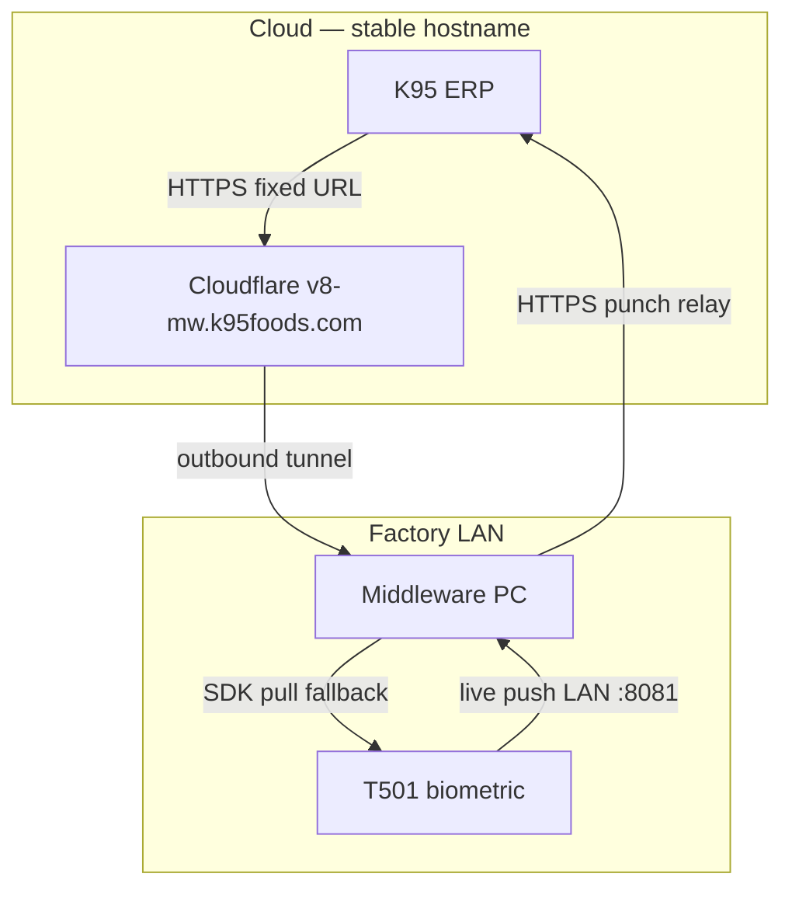

# Production Resilience — Factory PC with Non-Static ISP

This document lists failure modes when running the HR middleware on a factory PC behind a **dynamic public IP** router, what the stack does about each, and how to verify recovery.

## Architecture (what must stay up)



**ISP public IP changes** are handled by Cloudflare Tunnel (outbound connection). **LAN IP changes** on the middleware PC require live-push healing (see below).

---

## Failure modes (ranked)

### 1. Device live push stops (LAN IP / firewall)

| Symptom | Punches delayed or missing in real time |
| Cause | Middleware PC got new DHCP LAN IP; device still pushes to old IP. Windows firewall blocks :8081 on Public network profile. |
| Mitigation | SDK pull every 30s (supervisor). Auto-heal every 15 min via `ensure_device_live_push.py --fix`. |
| Manual fix | `python scripts/ensure_device_live_push.py --config configs/factory.yaml --fix` |
| Prevention | DHCP reservation for middleware PC on router. Run `scripts/fix_live_push_firewall.ps1` as Admin once. |

### 2. Outbound punch relay to ERP fails

| Symptom | Punches in local DB but not in ERP |
| Cause | ERP outage, bad API key/HMAC, network blip |
| Mitigation | Outbox retries (8 attempts, exponential backoff). HTTP retries on 502/503/504/timeouts. Hourly replay of FAILED rows. Worker no longer exits after 100 loop errors. |
| Manual fix | Fix credentials in config/env; FAILED rows auto-replay hourly |
| Verify | `var/worker/health.json` counts; gateway `/health` |

### 3. Cloudflare tunnel down (ERP → middleware)

| Symptom | ERP cannot sync employees / commands to site |
| Cause | cloudflared service stopped, PC offline, local gateway down |
| Mitigation | Windows service + watchdog every 3 min. Watchdog restarts supervisor if local gateway unhealthy. |
| Manual fix | `scripts/check_stack_status.ps1`; `scripts/ensure_cloudflare_tunnel.ps1` |
| Note | Punch **outbound** (site → ERP) does not use the tunnel |

### 4. Process hung (not crashed)

| Symptom | No response but process still running |
| Cause | Deadlock, stuck I/O |
| Mitigation | Supervisor liveness every 30s: HTTP `/health`, FK TCP :8081, worker health file freshness |
| Manual fix | Restart scheduled task `HRMS-Middleware-Supervisor` |

### 5. Middleware PC reboot / network slow at boot

| Symptom | Stack starts before network ready |
| Mitigation | 20s startup delay + up to 120s network wait (ping 8.8.8.8) |
| Config | `network_ready_max_wait_seconds` in `configs/factory.yaml` |

### 6. Device LAN IP change

| Symptom | SDK pull and commands fail |
| Mitigation | Update device registry via `/api/v1/devices` or dashboard admin |
| Prevention | Static IP on biometric device (DHCP off) |

### 7. Dead outbox after extended ERP outage

| Symptom | Rows stuck in FAILED |
| Mitigation | `failed_outbox_replay_enabled: true` resets FAILED → PENDING every hour |
| Config | `failed_outbox_replay_interval_seconds: 3600` |

---

## Recommended factory config

Use **`configs/factory.yaml`** (not quick tunnel):

```powershell
powershell -ExecutionPolicy Bypass -File .\INSTALL_ONE_CLICK.ps1 -Config configs/factory.yaml
.\SETUP_FACTORY_AUTOSTART.cmd
```

One-time device setup:

```powershell
# As Administrator — firewall for T501 live push
.\scripts\fix_live_push_firewall.ps1 -DeviceIp 192.168.29.44

# Point device at this PC
python scripts/configure_device_live_push.py --config configs/factory.yaml
```

---

## Monitoring

```powershell
.\CHECK_STATUS.cmd
# or
.\scripts\check_stack_status.ps1 -Config configs/factory.yaml
```

Checks: processes, gateway, FK port, worker health, tunnel public URL, live-push drift.

Log files:

| File | Purpose |
|------|---------|
| `var/logs/supervisor.log` | Process restarts, liveness, heal |
| `var/logs/cloudflared-watchdog.log` | Tunnel health |
| `var/worker/health.json` | Outbox counts |
| `var/fk_listener/health.json` | Last device push |
| `var/supervisor/health.json` | Supervisor heartbeat |

---

## What we intentionally do NOT rely on

- **Static public IP** — use Cloudflare named tunnel only
- **Quick tunnel (`trycloudflare.com`)** — URL changes on restart; dev only
- **Port forwarding on ISP router** — tunnel is outbound-only

---

## New resilience settings (factory.yaml)

| Setting | Default | Purpose |
|---------|---------|---------|
| `outbound_http_retries` | 2 | Retry transient ERP HTTP errors |
| `max_retries` | 8 | Outbox delivery attempts before FAILED |
| `failed_outbox_replay_enabled` | true | Hourly FAILED → PENDING |
| `worker_fatal_on_max_loop_errors` | false | Keep worker alive in factory |
| `live_push_auto_heal_enabled` | true | Supervisor runs device heal |
| `live_push_heal_interval_seconds` | 900 | Heal check interval |
| `network_ready_max_wait_seconds` | 120 | Boot network wait |
